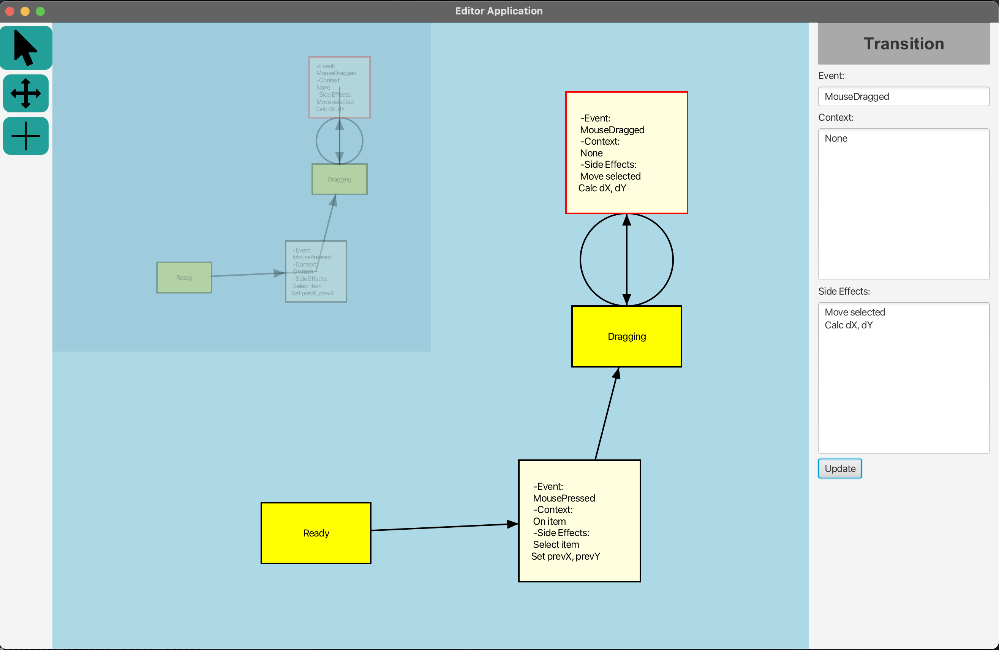

# Visual Editor Application
A JavaFX project interactive editor for building state-machine diagrams. The editor allows users to create state nodes, connect them with transition links, move and edit items in the workspace, and pan the view. The system also includes a tool palette and a property panel for editing details about the state nodes and transition links. 
The editor is built using immediate-mode graphics and has a complex model-view-controller architecture. The system also includes the ability to display multiple synchronized views of the same state-machine diagram.

The project is divided into four parts:

* The basic system and creation of nodes and links
* User interactions with the system
* Panning the view
* Multiple views and view synchronization

To use the editor, users can select a tool from the tool palette and use it to create state nodes and transition links in the workspace. The property panel allows users to edit the details of the selected node or link. Pressing the Delete key will delete the selected item and any dependent items.

This project demonstrates my skills in immediate-mode graphics, interaction with graphics, complex model-view-controller architectures, and multiple synchronized views.

## Supported Actions
1) Choose a tool from the left side-bar
  * Pointer cursor tool allows for creation and movement of state nodes.
  * Move cursor tool allows for panning the view-port of the main canvas.
  * Link cursor tool allows for creation of transition-link nodes.
2) Edit the details of a state node or link using the property panel in the right side-bar.
3) Create a new state node by `left-clicking` on canvas.
4) Create a new transition-link by selecting link cursor tool and `left-clicking` and drag from one state node to another (or the same state node for self-links).
4) Select a state node or transition-link node by `left-click`.
5) Move a state node or transition-link node by `left-click` and drag.
6) Delete a selected state node or transition-link node by pressing the `Delete` key.
7) Pan the view-port of the main canvas by selecting move cursor tool and `left-click` and drag on canvas. 

## Instructions for Running the Application
1. Please download the full source code or clone this repository.
2. Open the folder as an existing project in your IDE of choice (I use IntelliJ).
3. Navigate to `/src/main/java/com/example/visualeditor/application`.
4. Open the main file which starts the application named `EditorApp.java`.
5. Run the main method by clicking on the play button in the gutter.
